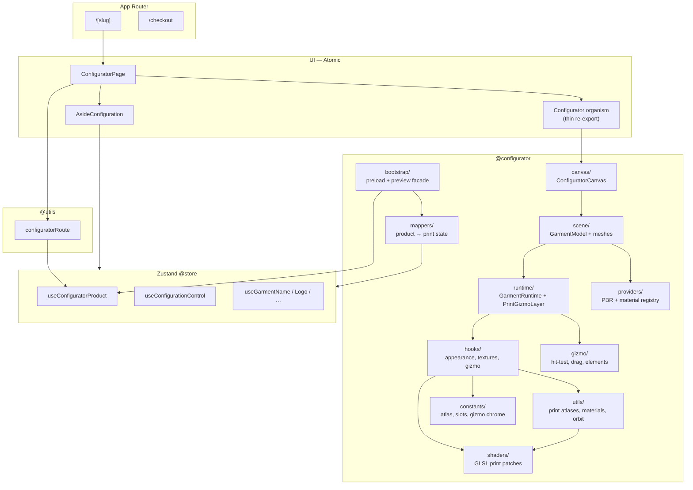

# Architecture

A browser-based **3D garment configurator** built with **Next.js 16** (App Router), **React Three Fiber** for real-time 3D rendering, and **Zustand** for global state.

The codebase separates concerns into four axes:

- **UI** — Atomic Design (`src/ui/`) — HTML panels, layout, checkout, home
- **Domain & state** — Zustand stores, app hooks, shared types (`src/store/`, `src/hooks/`, `src/types/`)
- **3D configurator** — R3F canvas, scene, GLSL shaders, gizmo, runtime (`src/configurator/`)

> **Rule of thumb:** R3F components, garment print utils, and configurator hooks **do not** live in Atomic organisms. The organism `Configurator` is a thin mount point that re-exports `@configurator/canvas`.

---

## Table of contents

1. [Repository layout](#repository-layout)
2. [High-level data flow](#high-level-data-flow)
3. [3D configurator module](#3d-configurator-module)
4. [UI layer (Atomic Design)](#ui-layer-atomic-design)
5. [Non-UI layers](#non-ui-layers)
6. [Next.js routing](#nextjs-routing)
7. [Technology stack](#technology-stack)
8. [Scripts & tooling](#scripts--tooling)
9. [Path aliases](#path-aliases)
10. [Conventions](#conventions)

---

## Repository layout

```
3D_T-shirts_Sportwear_Realize/
├── app/                    # Next.js App Router — thin route files, no business logic
├── public/                 # Static assets: GLTF models, textures, WASM, logos
├── scripts/                # Node asset-pipeline scripts
├── src/
│   ├── configurator/       # ★ 3D configurator module (R3F, scene, runtime, types)
│   ├── constants/          # Immutable configuration values
│   ├── data/               # Product JSON catalogs and accessors
│   ├── fonts/              # UI and garment-print fonts
│   ├── hooks/              # App-level React hooks (non-3D)
│   ├── providers/          # App-level React context (embedded mode, getStrictContext)
│   ├── shopify/            # Shopify Storefront / Admin API integration
│   ├── store/              # Zustand stores (global state)
│   ├── types/              # Shared TypeScript types (entities, UI, cart, …)
│   ├── ui/                 # UI components (Atomic Design)
│   └── utils/              # App utilities (catalog, logo, checkout, design)
├── playwright/             # End-to-end tests
└── ARCHITECTURE.md         # This document
```

---

## High-level data flow



1. **Route** resolves product (`ConfiguratorRouteShell` / Shopify) and calls `applyConfiguratorRouteProduct` from `@utils/configuratorRoute`.
2. **Store** holds user configuration (colors, design, names, logos, cart).
3. **`GarmentRuntime`** subscribes to stores via hooks and drives shader uniforms + gizmo interaction.
4. **UI panels** (molecules) read/write the same stores; they never import R3F scene internals directly.

---

## 3D configurator module

All real-time 3D logic lives in `src/configurator/`. Import via `@configurator` or subpath aliases (see [Path aliases](#path-aliases)).

### Structure

```
src/configurator/
├── index.ts              # Public API: ConfiguratorCanvas + bootstrap (warm, wait, preview)
├── bootstrap/            # App-facing facade: warm, wait, preview capture
│   ├── index.ts
│   ├── warmProductAssets/
│   ├── warmProductGltfCache/
│   └── previewCapture/   # Cart preview snapshot bridge
├── canvas/               # R3F <Canvas>, controls, scene mount
│   ├── ConfiguratorCanvas/
│   ├── CanvasControl/
│   ├── orbitGuard/       # aside hover + gizmo drag orbit lock
│   ├── SceneModel/
│   └── ViewControls/
├── scene/                # GLTF loading, mesh cloning, progressive mount
│   ├── gltf/             # buildGltfNodeIndex, waitForGltfModelReady
│   ├── meshHelpers/      # gltfMeshHelpers, resolvePreserveMeshes
│   ├── GarmentModel/
│   ├── GarmentMeshes/
│   └── useStaggeredMeshMount/
├── runtime/              # Side-effect layers inside <Canvas>
│   ├── GarmentRuntime/
│   └── PrintGizmoLayer/
├── hooks/                # R3F-facing React hooks
│   ├── useSyncGarmentMaterials/
│   ├── useGarmentLogoTextures/    # stamp atlas + useLogoUniformSync
│   └── useGarmentTextPrintTextures/  # name/number/testo (was useGarmentNameTextures)
├── mappers/              # Product JSON → runtime state (@store)
│   └── printLayout/      # UV math (no utils dependency)
├── gizmo/
├── shaders/
├── providers/
├── constants/
├── utils/                # Domain barrels: loading, print, material, render
│   ├── loading/          # gltfModelCache, warm*, loadImage, resolveModelUrl
│   ├── print/            # garmentPrint, compose*Atlas, drawNameOnAtlas
│   ├── material/         # createGarmentMaterial, compileGarmentShadersOverFrames
│   ├── render/           # orbitCamera, garmentGradient, resolveProductRenderConfig
│   └── index.ts          # re-exports all domain barrels
└── types/
```

### Layer responsibilities

| Layer       | Alias                     | Responsibility                                                               |
| ----------- | ------------------------- | ---------------------------------------------------------------------------- |
| `bootstrap` | `@configurator`           | **Public app API**: warm assets, wait for GLTF, preview capture, image cache |
| `mappers`   | `@configurator/mappers`   | Map product JSON → print positions, instances, gradients                     |
| `canvas`    | `@configurator/canvas`    | WebGL canvas, orbit controls, preview capture wiring                         |
| `scene`     | `@configurator/scene`     | Load GLTF, clone meshes, register garment materials                          |
| `runtime`   | `@configurator/runtime`   | In-canvas side effects: textures, gizmo selection/drag                       |
| `hooks`     | `@configurator/hooks`     | React hooks that bridge `@store` ↔ shader uniforms                           |
| `utils`     | `@configurator/utils`     | Atlases, uniform builders, material factory, orbit math                      |
| `gizmo`     | `@configurator/gizmo`     | Hit-testing, drag resolution, gizmo element builders                         |
| `shaders`   | `@configurator/shaders`   | GLSL fragments/vertex patches for garment print material                     |
| `providers` | `@configurator/providers` | Bridge scene materials ↔ hook-driven uniform updates                         |
| `constants` | `@configurator/constants` | Atlas dimensions, UV bounds, slot counts, gizmo chrome                       |
| `types`     | `@configurator/types`     | Configurator, shader, and gizmo types                                        |

### R3F component tree (simplified)

```
ConfiguratorCanvas
└── CanvasControl          ← useCartPreviewCapture, ViewControls
└── SceneModel
    └── GarmentModel       ← GLTF + GltfSceneProvider (native PBR from mesh materials)
        ├── GarmentMeshes  ← GarmentPartMesh | StaticGltfMesh | PreserveGltfMesh
        └── GarmentRuntime ← useSyncGarmentMaterials, useGarment*Textures
            └── PrintGizmoLayer ← gizmo hit-test / drag (renders null; shader-drawn UI)
                └── PrintGizmoInstance × N
```

### Configurator types (`@configurator/types`)

Types that belong to the 3D module — **not** general UI or catalog entities:

| Type                               | Purpose                                   |
| ---------------------------------- | ----------------------------------------- |
| `configuratorStepValueType`        | Wizard step identifiers                   |
| `configuratorProductHydrationType` | Product payload from route / Shopify      |
| `garmentGltfSceneType`             | Typed GLTF nodes/meshes index             |
| `PrintPlacementInstance`           | UV placement for name/number/logo/testo   |
| `*PropsType` (scene components)    | R3F component props (part mesh, gizmo, …) |

Shared domain types (`garmentConfigType`, cart, checkout) remain in `@types/entities` and `@types/garment`. Shader pipeline, gizmo, and in-canvas provider types (`garmentPrintStateType`, `garmentMaterialRegistryValueType`, `printGizmoElementType`, …) live in `@configurator/types`.

---

## UI layer (Atomic Design)

All UI lives under `src/ui/` and follows Atomic Design tiers.

| Layer         | Path                                  | Alias        | Responsibility                                                           |
| ------------- | ------------------------------------- | ------------ | ------------------------------------------------------------------------ |
| **Atoms**     | `src/ui/components/atomic/atoms/`     | `@atoms`     | Smallest blocks: `Button`, `AtomInput`, `ColorPicker`, `AtomSkeleton`    |
| **Molecules** | `src/ui/components/atomic/molecules/` | `@molecules` | Step panels: `ConfigurationDesign`, `LogoUpload`, `ConfiguratorStepTabs` |
| **Organisms** | `src/ui/components/atomic/organisms/` | `@organisms` | `AsideConfiguration`, `ConfiguratorView`, `Configurator` (thin 3D mount) |
| **Templates** | `src/ui/components/atomic/templates/` | `@templates` | Page layouts without data coupling (`ConfiguratorLayoutTemplate`)        |
| **Pages**     | `src/ui/components/atomic/pages/`     | `@pages`     | `ConfiguratorPage`, `HomePage`, `CheckoutPage`                           |
| **Shared**    | `src/ui/components/shared/`           | `@shared`    | shadcn/Radix primitives (`Dialog`, `Accordion`, …)                       |
| **Skeletons** | `src/ui/components/skeletons/`        | `@skeletons` | Loading skeletons mirroring configurator/checkout layouts                |

### Configurator UI vs 3D module

| Concern              | Location                                                 |
| -------------------- | -------------------------------------------------------- |
| HTML sidebar / steps | `@molecules` / `@organisms` (`AsideConfiguration`, …)    |
| 3D canvas mount      | `@organisms/Configurator` → `@configurator`              |
| Page layout          | `ConfiguratorView`, `ConfiguratorPage`                   |
| Route hydration      | `ConfiguratorRouteShell` in `ConfiguratorLayoutTemplate` |

```tsx
// organisms/Configurator/Configurator.tsx — intentional thin shell
export { ConfiguratorCanvas as Configurator } from '@configurator';
```

### UI conventions

1. **`app/` routes** only import from `@pages` — no business logic in route files.
2. **Atoms** are presentational: props only; no store, API, or 3D dependencies (e.g. `Logo` receives `href` from `Header`).
3. **Molecules** may read stores and use hooks from `@hooks`.
4. **Organisms** compose molecules/atoms; the 3D organism does **not** embed scene code.
5. **Skeletons** match target layouts; visibility via `useShowConfigurationSkeleton`.
6. **HTML component prop types** live in `src/types/ui/`.
7. **Every component** uses folder + `index.ts` barrel: `ComponentName/ComponentName.tsx` + `index.ts`.

---

## Non-UI layers

### `src/hooks/` (`@hooks`)

App-level React hooks (navigation, checkout, cart sync, skeletons, logo upload, catalog preload).  
3D hooks live in `@configurator/hooks` only.

| Category        | Examples                                                                                                                |
| --------------- | ----------------------------------------------------------------------------------------------------------------------- |
| Configurator UX | `useConfiguratorInitialSceneLoad`, `useGarmentCatalogPreload`, `resolveProductStepsConfiguration`, `useLogoFileHandler` |
| Store wrappers  | `useConfigurationCartSync`, `useProductStepsConfiguration` (merges step meta + `@molecules` content)                    |
| UI state        | `useSlidingIndicator`, `useShowConfigurationSkeleton`                                                                   |
| Checkout        | `useCheckoutInit`, `useNavigateToCheckout`                                                                              |

> Zustand stores in `src/store/` are named `use*` but are **not** React hooks.

### `src/store/` (`@store`)

Domain-scoped Zustand stores:

| Store                                                               | Responsibility              |
| ------------------------------------------------------------------- | --------------------------- |
| `useConfiguratorProduct`                                            | Active catalog product      |
| `useConfigurationControl`                                           | Wizard steps and navigation |
| `useConfigurationCart`                                              | Session configuration cart  |
| `useGarmentColor` / `Design` / `Name` / `Number` / `Logo` / `Testo` | Garment configuration       |
| `useConfiguratorSceneLoad`                                          | 3D scene loading state      |
| `useCheckout`                                                       | Checkout rows and pricing   |

Each store is a folder: `useStoreName/useStoreName.ts` + `index.ts`. Helpers (`map*.ts`, cart/checkout utils) live in **their own subfolders** with `index.ts` — not as loose files next to sibling subfolders. Print/gradient mappers re-export from `@configurator/mappers`.

### `src/types/` (`@types`)

Shared types not owned by the configurator module:

```
src/types/
├── cart/           # Cart items, configuration snapshots
├── checkout/       # Checkout table, summary
├── entities/       # Types derived from JSON catalogs (source of truth)
├── garment/        # Runtime garment types composed from entities
├── ui/             # HTML component props, variant unions
└── index.ts
```

Configurator types: prefer `@configurator/types` (also exported from `@configurator`).

### `src/utils/` (`@utils`)

App-wide pure utilities: catalog, logo file conversion, checkout dates, design SVG tinting.  
3D/print utilities live in `@configurator/utils` only.

### `src/configurator/gizmo/` (`@configurator/gizmo`)

Framework-agnostic gizmo logic: hit-testing, drag resolution, printable mesh construction, button hover/reveal state.  
Used by `@configurator/runtime` and `@configurator/hooks`. Imports math from `@configurator/utils`.

Structure: `featureName/featureName.ts` + `index.ts`; barrel at `src/configurator/gizmo/index.ts`.

### `src/configurator/shaders/` (`@configurator/shaders`)

GLSL patches for `MeshStandardMaterial`: print layers, logos, names, numbers, testo, gradients, atlas tinting.  
Consumed by `@configurator/utils/createGarmentMaterial`.

### `src/shopify/` (`@shopify`)

Shopify Storefront GraphQL, product/collection resolution, `configuratorProductHydrationType` mapping.

### `src/constants/` (`@constants`)

Single barrel file `index.ts` — catalog, UI copy, checkout labels, palette, logo-upload UI.  
3D print pipeline values (atlas size, slot counts, gizmo chrome, garment fonts) live in `@configurator/constants`.  
Wizard step metadata: `CONFIGURATOR_STEP_META`. React step wiring: `STEPS_CONFIGURATION` (exported from `@molecules`).

### `src/providers/` (`@providers`)

App-level React context: embedded mode, shared `getStrictContext` helper for UI primitives.

### `src/configurator/constants/` (`@configurator/constants`)

Immutable values for the 3D print pipeline: `PRINT_ATLAS_*`, `FULL_UV_BOUNDS`, name/logo slot counts, gizmo chrome, `FONT_FAMILY_BY_NAME`, reference font sizes.  
Imported only from `@configurator/**` and `@store` mappers — never from `@constants`.

### `src/configurator/providers/` (`@configurator/providers`)

3D-only providers used inside `<Canvas>` / garment scene: `GarmentMaterialRegistryProvider`. Garment meshes clone native GLTF `MeshStandardMaterial` (PBR maps stay on the source material); the configurator only resets base color for print compositing and upgrades shaders via `createGarmentMaterial`.

### `src/data/` (`@data`)

JSON product catalogs and modal info content. Catalog accessors (`getModel`, `MODELS`, …) live in `@utils/garmentCatalog`.

### `src/fonts/` (`@fonts`)

UI fonts (`inter`) and sport fonts for garment text rendering.

---

## Next.js routing

```
app/
├── layout.tsx                          # Root layout (<html>, fonts, global styles)
├── (shop)/                             # Scrollable shop shell — URL: /, /checkout
│   ├── layout.tsx                      # <body> + Header + main
│   ├── (default)/
│   │   ├── layout.tsx                  # Footer wrapper
│   │   └── page.tsx                    # / → HomePageLoader (async RSC)
│   └── checkout/
│       └── page.tsx                    # /checkout → CheckoutPage
└── [slug]/                             # Product configurator — URL: /:slug
    ├── layout.tsx                      # ConfiguratorLayoutTemplate + Shopify product resolve
    └── page.tsx                        # ConfiguratorPage
```

| URL         | Page component                | Notes                                        |
| ----------- | ----------------------------- | -------------------------------------------- |
| `/`         | `HomePageLoader` → `HomePage` | Product gallery (async catalog load)         |
| `/checkout` | `CheckoutPage`                | Static route; wins over `[slug]`             |
| `/:slug`    | `ConfiguratorPage`            | Layout resolves product; page mounts UI + 3D |

Routes stay **thin**: import from `@pages` only.

---

## Technology stack

| Library                                         | Role                                  |
| ----------------------------------------------- | ------------------------------------- |
| **Next.js 16**                                  | SSR/SSG, App Router, routing          |
| **React 19**                                    | UI runtime                            |
| **TypeScript 5**                                | Static typing                         |
| **Tailwind CSS 4**                              | Styling                               |
| **Zustand**                                     | Global client state                   |
| **React Three Fiber + drei**                    | 3D canvas, GLTF loading, controls     |
| **Three.js**                                    | Rendering, textures, custom shaders   |
| **Radix UI / Base UI**                          | Accessible primitives (shadcn)        |
| **Motion**                                      | UI animations                         |
| **pdfjs-dist, ghostpdl-wasm, imagemagick-wasm** | In-browser PDF/EPS logo conversion    |
| **Playwright** (dev)                            | End-to-end tests                      |
| **ESLint + Prettier + Husky**                   | Linting, formatting, pre-commit hooks |

---

## Scripts & tooling

| Script                               | Description                                                                                              |
| ------------------------------------ | -------------------------------------------------------------------------------------------------------- |
| `dev` / `build` / `start`            | Next.js development and production                                                                       |
| `lint` / `lint:fix`                  | ESLint over `src/` and `scripts/`                                                                        |
| `format` / `format:check`            | Prettier                                                                                                 |
| `validate`                           | format + lint + `typecheck` + `verify:architecture`                                                      |
| `typecheck`                          | `tsc --noEmit`                                                                                           |
| `verify:architecture`                | Legacy paths + import boundaries + module folder structure + 3D constants outside configurator (`scripts/verify-architecture.mjs`) |
| `scan:module-structure`              | Standalone check for module folder pattern (`scripts/scan-module-structure.mjs`)                                                   |
| `convert:design-assets`              | SVG design masters → WebP for 3D print atlas (keeps `.svg` originals)                                    |
| `sync:wasm-assets`                   | Optional — refresh logo-upload WASM in `public/ghostscript/` after dependency upgrades                   |
| `optimize:model` / `optimize:models` | Dev-only GLTF → GLB compression (UV-safe); not part of CI                                                |
| `test:unit`                          | Vitest — printLayout, render config, gizmo drag                                                          |
| `test:visual`                        | Playwright                                                                                               |

Node scripts in `scripts/`:

| Script                      | Keep?                                                     | Role                                                                   |
| --------------------------- | --------------------------------------------------------- | ---------------------------------------------------------------------- |
| `verify-architecture.mjs`   | Yes                                                       | CI — legacy paths + import boundaries + module folder structure      |
| `scan-module-structure.mjs` | Yes (manual / CI via verify)                              | Module folder pattern only                                             |
| `lib/scan-module-structure.mjs` | Yes                                                   | Shared scanner used by verify + scan scripts                           |
| `convert-design-assets.mjs` | Yes                                                       | Asset pipeline — rasterize heavy design SVGs to WebP for runtime atlas |
| `sync-wasm-assets.mjs`      | Optional manual — refresh WASM after npm package upgrades |
| `optimize-gltf-model.mjs`   | Yes (manual)                                              | Optional dev tool when updating garment GLTF sources                   |

Removed one-off migration scripts (`add-use-client`, `rename-types-to-camel-type`) and design thumbnail generation (UI uses `public/svg/design/*.svg` templates).

---

## Path aliases

Defined in `tsconfig.json`:

| Alias                         | Path                          |
| ----------------------------- | ----------------------------- |
| `@atoms` … `@pages`           | `src/ui/components/atomic/*`  |
| `@shared`                     | `src/ui/components/shared`    |
| `@skeletons`                  | `src/ui/components/skeletons` |
| `@styles`                     | `src/ui/styles/globals.css`   |
| `@hooks`                      | `src/hooks`                   |
| `@store`                      | `src/store`                   |
| `@types`                      | `src/types`                   |
| `@utils`                      | `src/utils`                   |
| `@data`                       | `src/data`                    |
| `@constants`                  | `src/constants`               |
| `@providers`                  | `src/providers`               |
| `@fonts`                      | `src/fonts`                   |
| `@shopify`                    | `src/shopify`                 |
| **`@configurator`**           | `src/configurator`            |
| **`@configurator/bootstrap`** | `src/configurator/bootstrap`  |
| **`@configurator/gizmo`**     | `src/configurator/gizmo`      |
| **`@configurator/shaders`**   | `src/configurator/shaders`    |
| **`@configurator/mappers`**   | `src/configurator/mappers`    |
| **`@configurator/providers`** | `src/configurator/providers`  |
| **`@configurator/canvas`**    | `src/configurator/canvas`     |
| **`@configurator/scene`**     | `src/configurator/scene`      |
| **`@configurator/runtime`**   | `src/configurator/runtime`    |
| **`@configurator/hooks`**     | `src/configurator/hooks`      |
| **`@configurator/utils`**     | `src/configurator/utils`      |
| **`@configurator/types`**     | `src/configurator/types`      |
| **`@configurator/constants`** | `src/configurator/constants`  |

**Wildcard subpaths** (sibling modules within the same alias root):

| Pattern                 | Example                                      |
| ----------------------- | -------------------------------------------- |
| `@configurator/hooks/*` | `@configurator/hooks/useGizmoIconAtlas`      |
| `@configurator/scene/*` | `@configurator/scene/meshHelpers`            |
| `@molecules/*`          | `@molecules/ConfigurationTools/ColorControl` |
| `@store/*`              | `@store/useGarmentName`                      |
| `@utils/*`              | `@utils/logoFile/detectFormat`               |
| `@data/*`               | `@data/baggio_calcio/baggio_calcio.json`     |

Do **not** import `@configurator/utils/loading|print|material|render` — use the **`@configurator/utils`** barrel only.

---

## Conventions

### Import rules (configurator)

| From                                                  | Import via                                                                                                                                                                                            |
| ----------------------------------------------------- | ----------------------------------------------------------------------------------------------------------------------------------------------------------------------------------------------------- |
| R3F components / runtime                              | `@configurator`, `@configurator/scene`, …                                                                                                                                                             |
| 3D hooks                                              | `@configurator/hooks`                                                                                                                                                                                 |
| Print / material / render utils (inside configurator) | `@configurator/utils`                                                                                                                                                                                 |
| UV bounds / local→atlas                               | `@configurator/mappers` (`printLayout`)                                                                                                                                                               |
| Configurator types                                    | `@configurator/types`                                                                                                                                                                                 |
| Gizmo math                                            | `@configurator/gizmo`                                                                                                                                                                                 |
| GLSL shader patches                                   | `@configurator/shaders`                                                                                                                                                                               |
| Product → print state maps                            | `@configurator/mappers` (re-exported via `@store`)                                                                                                                                                    |
| Warm / preview (app + store)                          | `@configurator` bootstrap: `ConfiguratorCanvas`, `warmProductAssets`, `warmProductGltfCache`, `waitForProductModelReady`, `captureConfiguratorPreviewSnapshot`, `isGltfModelReady`, `loadCachedImage` |
| Route → store hydration                               | `@utils/configuratorRoute` (`applyConfiguratorRouteProduct`, `resolveRouteModel`)                                                                                                                     |
| In-canvas React context                               | `@configurator/providers`                                                                                                                                                                             |
| 3D pipeline constants                                 | `@configurator/constants`                                                                                                                                                                             |
| Product catalog (`getModel`)                          | `@utils` (`garmentCatalog`)                                                                                                                                                                           |
| User configuration                                    | `@store`                                                                                                                                                                                              |

**Inside `@configurator`:** import utils via **`@configurator/utils`** — not relative `../utils/...` paths and not `@configurator/utils/loading|print|…` domain subpaths.

**Outside `@configurator`:** `@store` and app hooks use **`@configurator`** bootstrap facade; `@configurator/mappers` / `@configurator/types` where needed — not layer subpaths.

**Cross-module imports:** use **`@` path aliases** (layer barrels or wildcard subpaths). Relative `import … from '../…'` / `import … from './…'` is **not allowed** in implementation files. **`index.ts` barrel re-exports** may still use `export { X } from './X'`.

ESLint `no-restricted-imports` blocks `@configurator/utils/*` subpaths. `verify:architecture` blocks relative imports, legacy folder paths, and module folder structure violations.

### Module folder pattern

Every exportable unit in `src/` follows Atomic-style folders. **Enforced by `verify:architecture`** (`scripts/lib/scan-module-structure.mjs`).

#### Single module

```
FeatureName/
├── FeatureName.ts(x)   # primary implementation (name matches folder)
└── index.ts            # export * from './FeatureName'  (or named export for components)
```

#### Section folder (only subfolders + one barrel)

At layer roots (`shopify/`, `hooks/`, `store/`, `canvas/`, …) and grouping folders (`garmentPrint/`, `previewCapture/`):

- **Only** `index.ts` and named subfolder-modules — no loose `.ts`/`.tsx` next to subfolders.
- `index.ts` re-exports public API from child modules.

#### Module with helpers

When a module has both a primary file and helpers, helpers get **their own subfolders** (same pattern), not loose siblings:

```
useSyncGarmentMaterials/
├── useSyncGarmentMaterials.ts
├── index.ts
├── buildPatternColors/
│   ├── buildPatternColors.ts
│   └── index.ts
└── syncGarmentMaterialState/
    ├── syncGarmentMaterialState.ts
    └── index.ts
```

Sibling imports stay `./buildPatternColors` (resolves to subfolder `index.ts`).

#### Container-only folder

Folders that contain **only** subfolders (no primary file) must have `index.ts` that re-exports children:

```
composeLogoAtlas/
├── index.ts              # export * from './composeLogoPrintAtlas'; …
├── composeLogoPrintAtlas/
└── composeLogoStampAtlas/
```

**Exceptions (no `index.ts` required):** organizational roots `src/ui`, `src/ui/components`, `src/ui/components/atomic` — they group atomic layers, not exportable modules. Config files (`config.ts`) and ambient `.d.ts` are exempt.

Applies to: UI components, stores, hooks, Shopify clients, configurator layers, utils, types submodules.

**Store → configurator:** `@store` may import `@configurator/mappers`, `@configurator/constants`, and the **bootstrap facade** from `@configurator` (preload, preview capture, image cache). It must not import `@configurator/utils`, `@configurator/scene`, `runtime`, or `canvas` directly.

**App hooks → configurator:** preload hooks import the same bootstrap facade from `@configurator`, not layer subpaths. Logo upload resolves natural image size in `useLogoFileHandler` via `loadCachedImage` — not in `@store`. Step availability logic lives in `@hooks/resolveProductStepsConfiguration` (meta only); UI step panels merge content from `@molecules`.

**Reverse boundaries:** `@configurator` must not import `@utils`. `@molecules` may import `@configurator/types` only (no runtime/configurator barrels). Scene component prop types live in `@configurator/types`, not `@types/ui`.

**Sibling modules** within the same alias root (e.g. hooks → hooks, molecules → molecules) use **wildcard subpaths** such as `@configurator/hooks/useGizmoIconAtlas` or `@molecules/ConfigurationTools/ColorControl` — not `../` chains.

### Deprecation policy

Import 3D code only from `@configurator/*`. Configurator, shader, and gizmo types from `@configurator/types`.
